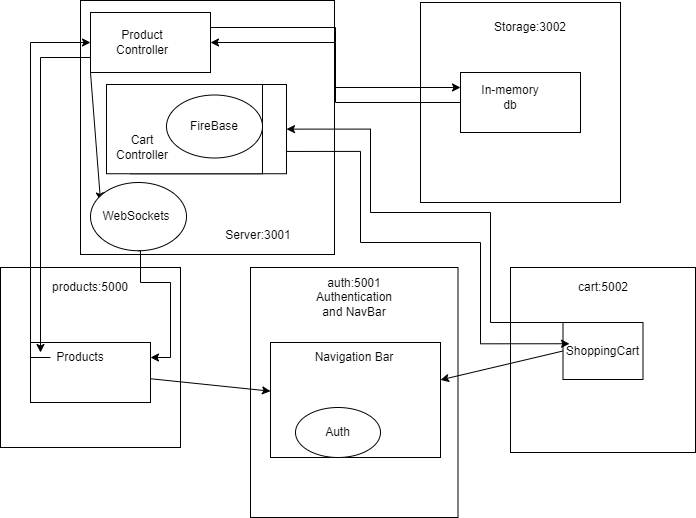
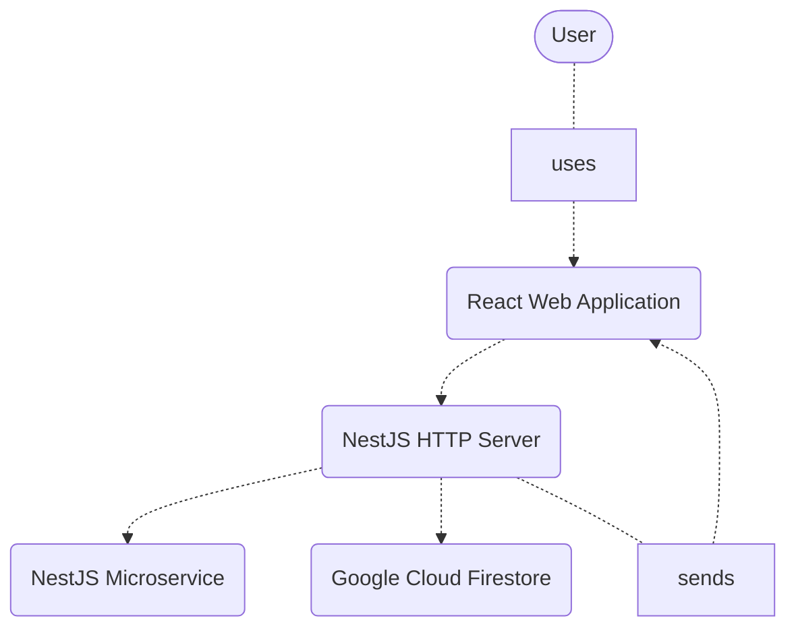
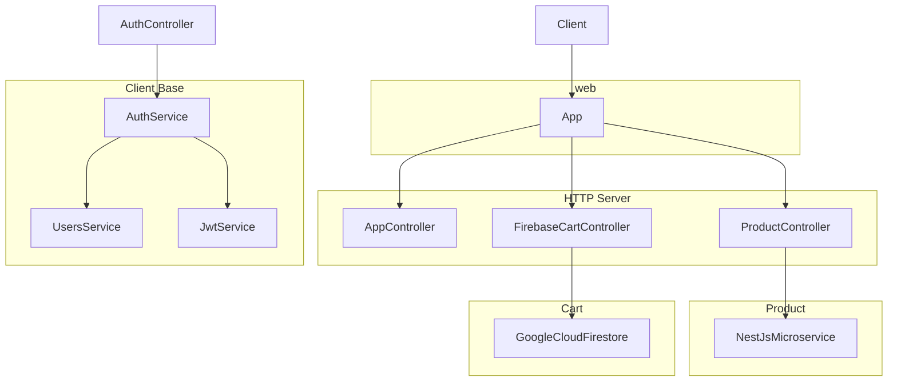
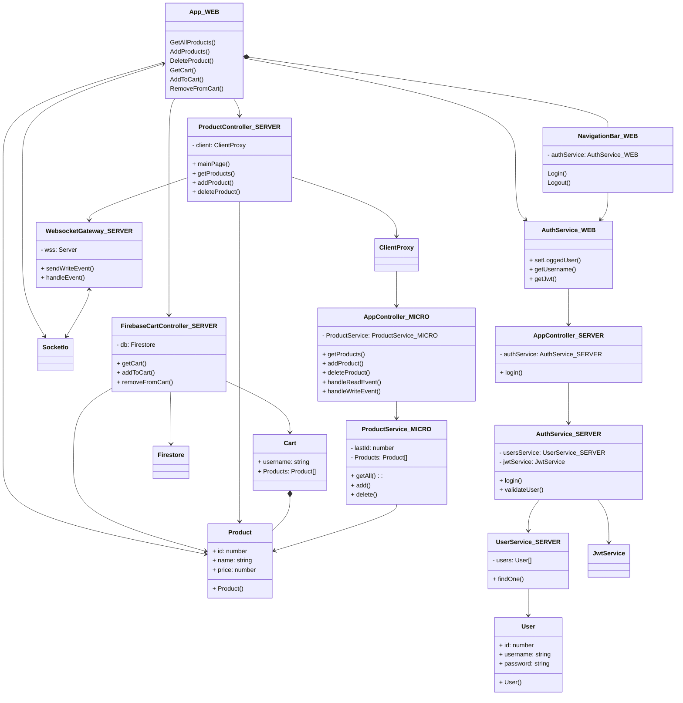

# SOA

### Application architecture

### APIs

* http://localhost:3001 - main server of the application. It provides api endpoint for crud operations for the Product
  entity
    * @Get('products') getProduct()
    * @Post('products') @UseGuards(JwtAuthGuard) addProduct(@Body() product: Product)
    * @Delete('products/:id') @UseGuards(JwtAuthGuard) deleteProduct(@Param('id') productId: number)
    * @Get('cart/:username') @UseGuards(JwtAuthGuard) getCart(@Param('username') username: string)
    * @Post('cart/:username') @UseGuards(JwtAuthGuard) addToCart(@Param('username') username: string, @Body() product:
      Product)
    * @Delete('cart/:username') @UseGuards(JwtAuthGuard) removeFromCart(@Param('username') username: string,@Body()
      product: Product)
* http://localhost:3002 - main in-memory storage for the products of the application. It is used by the main server to
  store/alter/retrieve data
* http://localhost:5001 - main entry for the microfrontends. It contains the authentication part and the navigation
    * exposes {} remotes{Products from http://localhost:5000 and ShoppingCart form http://localhost:5002}
* http://localhost:5000 - microfrontend that handles the display and the crd of products
    * exposes {Products} remotes{}
* http://localhost:5002 - microfrontend that handles the display and the rd of cart products
    * exposes {ShoppingCart} remotes{}

### Docker

Each microservice/microfrontend is running inside a docker container. The instructions for building a container can be
found in the docker-compose.yaml files from each service directory: docker-compose.yaml exposes a port for each
container and give them a name and the actual steps: copying the folder package.json and folder contents, npm install
and npm run build:dev are found in the Dockerfile

### MicroFrontends - ModuleFederationPlugin

ModuleFederationPlugin was used in order to share components between microfrontends. The info regarding the
microfrontend name, what it exposes and what it uses from remote can be configured in the webpack.config.js file from
each service folder

### MicroServices - nestjs

NestFactory from nestjs was used on the backend part to create microservices. In the main.ts file the microservice
configuration was defined:  eg. { transport: Transport.TCP, options: { host: '0.0.0.0', port: 3002, retryAttempts:
5}

### 3rd Party App - Firebase

Firebase was used as a database for the cart items. After passing the connection json to the Firebase ex. {credential:
admin.credential.cert(serviceAccountJson as ServiceAccount)}, the response db component is stored and used to store and
get cart information:  

eg.  
this.db = admin.firestore();  
const docRef = this.db.collection('carts').doc(username); 
await docRef.set(JSON.parse(JSON.stringify(cart))); 

### Messaging Layer - WebSockets from @nestjs

On backend the main server is sending messages via a WebSocket that are received by the frontends by using
socket.io-client library which connects to the nestjs WebSocket  

eg.  
`server:`
  @WebSocketServer() wss: Server;
 this.wss.emit('write-event', message);
  `clinet:`
 const socket = io(API_URL, {autoConnect: true});
 socket.on('write-event', (data: any) => {  
&nbsp;&nbsp;&nbsp;&nbsp;console.log('WebSocket write-event ${data}'); 
&nbsp;&nbsp;&nbsp;&nbsp;handleGetAllProducts(); 
})

### System diagram

### Component diagram

### Code diagram
